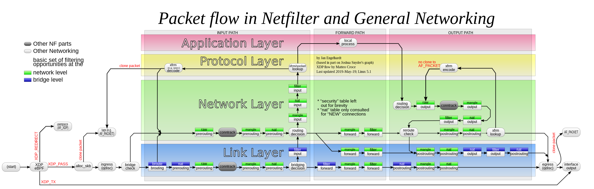

# Wireguard Portals
*Now you're thinking with portals*

## What is it? 
This is a helper script that makes it easy to set up bi-directional, site-to-site transparent proxies and bounce-servers using Wireguard. 

I've been setting up these types of servers for years - in many different configurations. I've used IPsec, OpenVPN, and now Wireguard. And it seems like everytime I do this, I realize I've forgotten something. So this script is also a kind of brain-dump/swiss army knife of all the debugging techniques and resources I've found over the years. 

## Why?
There may be cases where you want your traffic entering in NYC to come out in Paris, for uh, reasons. 

I'm nicknaming these kinds of bounce-servers to be portals. Wireguard Portals because these scripts use Wireguard as the VPN transport.  Traffic goes in on your end, travels over the internet, and comes out the other. 


Of course, it is also useful to access the actual computers at the site, so you can do that too. 

Additionally, this script will configure a WiFi hotspot if your machine has a WiFi card that suports HostAP mode (most do), or just serve DHCP over a secondary NIC, if your machine has a dual NICs, or both! 

This script is designed to be easy to use by notices with no scripting experience (but some experience will help!). I'm a big fan of legos, and the functions are small, single purpose, and composable. 

I'm including instructions for running this script on plain-old Linux. (bare hardware, a VM, or even Docker), on the (now discontinued) $50 EdgeRouter X (ER-X), or on the Unifi Routers like Unifi Dream Machine/UDMPro. I've recently been partial to the also dirt cheap dual LAN port Ace Magician MiniPCs like the T8 Pro. 

## Lets get on with it! 



Think of wireguard as a simple point-to-point pipe. Anything that you send into it, comes out on the other end, with no transformation. Likewise, anything that goes into it from the other end, shows up on your end. Actually, Wireguard supports multiple peers - so its actually a point-to-multi-point pipe. It does a tiny-bit of routing in that it will only send traffic that to the destination according to the `allowed-ips` of the the peer. 

Lets say you have a Wireguard network on site A with an IP of 10.1.1.1/32. If the remote has an ip of 10.1.1.2/32 then these two devices can talk to each directly, with no special routing needed. But this isn't that useful. If you want site B to access all of the computers connected to site A, you need to do some routing. The smallest subnet is 10.1.1.0/24. Lets split that into 2: site A to have a subnet of 10.1.1.0/25, and site B will have 10.1.1.128/25. Site A will have 10.1.1.1 and B will have 10.1.1.128. You still don't need to do any fancy routing, Wireguard itself will route traffic from site A destined to any computer in 10.1.1.128/25 via 10.1.1.128, and also backwards - traffic from site B will go to any computer in 10.1.1.0/24 via 10.1.1.1. 

However, this requires manual numbering of your computers - if you tried to use DHCP to serve addresses at both sites, you'll get conflicts, as DHCP uses broadcast packets and these packets will go to both sides, and cause problems. You could solve this problem by picking a IP-range for Wireguard from within your current network segment. i.e. lets say your home router is using the subnet 10.1.0.0/22 (10.1.0.0 - 10.1.3.254). Then you could have your DHCP server serve the 10.1.2.0/23 subnet (10.1.2.1 - 10.1.3.254) - as long as you block the DHCP server from accessing the Wireguard interface. 

Or for more flexibility, you can leave your existing home network exactly how it is, and create a new subnet just for Wireguard. Then, if you want to route traffic from your home net to onto the wireguard net, you just need to add a simple static route. 

* Assuming your home network is using 192.168.1.1/24
* Assuming Wireguard is using the 10.1.1.0/24 net (10.1.1.1 - 10.1.1.254) then

```
ip route add 10.1.1.0/24 via dev wg0 
```

Now, packets destined for destinations at 10.1.1.0/24 will exit using wg0. 

You can use `tcpdump -i wg0` on the remote address to see the packets come in. But theres a problem - no response packets. Thats because site B saw the packet, forwarded it to destination, and the destination replied back, but now the site B doesn't know where to send the return packet - because the the original packet has a sender address in the 192.168.1.1/24 range. Or worse, maybe the remote is also using the 192.168.1.1/24 range for its network, and the packet goes to totally different computer. How do you fix this?!? Well, this is exactly what NAT was designed for. 

SNAT (or MASQUERADE) will re-write the packets as they leave Site A to have the address of the router (in this case the address of the Wireguard interface). (The details of this is very cool, it involves encoding the origin in a port:ip table. Each outgoing packet uses a different source port instead of the original port. On the way back, the response is looked up from this table, and retranslated to the original destinationn) After this change, the remote site will know where to send the response packet. 

Whats important to know is that you only need SNAT when leaving your home router and going over to the other side. The other side doesn't see the original source addresses. There is an alternative - and that is actually configuring a backwards route from Site B. But now site B needs to be aware of the configuration of Site A, which is a lot of configuration to manage. Additionally, you can't use the same subnet on both sides of the VPN link. 

OK, thats basically it in a nutshell. 

## What this about a bounce server? 
A bounce server, is slang for a server that basically accepts connections from the internet (over an incoming VPN link) and then exits them back to the internet. Tailscale calls this an "exit node." Because thats where traffic exits from. ;-) 

So how do we get Wireguard to route this traffic? Wireguard doesn't care how "big" the subnet is behind the site! What if you use the biggest subnet - the entire internet: 0.0.0.0/0. Sure thats fine! Basically, all traffic that makes it to the the wireguard interface will be routed to the other side - all addresses in this case. 

Above I mentioned that Site B doesn't know the specific origin of the packets from Site A - just that the site A router sent them. Likewise, to anyone paying attention to the source of a packet that is leaving Site B, they do not know that it came from site A, or someplace beyond. The traffic coming from Site A (via Site B) is literally indistinguishable from traffic coming from Site B directly.  

## What if don't want all my internet traffic going over the VPN. 
Me neither! My VPN link sorta slow. You can *seletively* route traffic to this other site, based on the source (or any other policy). This is called policy based routing. What I like to do is set up some special device: a seperate Wifi SSID ideally, a VLAN, or a secondary physical NIC - or even a WiFi router plugged into the secondary NIC. Whatever floats your boat! Basically, anything connected to this will *transparently* be configured to route to the the other site. No client configuration required! Or, in the case of SSIDs, all you have to do is switch to a different SSID temporarily.  

## Bidirectional links - portals in both directions
Once you have a Wireguard link between two notes, you can leverage this link in both directions! Unlike Tailscale, which [does not allow an exit node to also use an exit node](https://github.com/tailscale/tailscale/issues/3569), wireguard is totally fine with exits in both directions at the same time.  All you need to do is set `allowed-ip` to 0.0.0.0/0 on both sides, and set up SNAT on each direction, mirroring each other. Traceroutes for 8.8.8.8 from site A will go through site B, and vice versa. 

## Multiple site-to-site transparent peers
Wireguard allows multiple peers, so in theory, you could add 0.0.0.0/0 to the `allowed-list` of all the peers. However, this doesn't work. Wireguard silently ignores this. In fact, and 'overlapping' nets in the list of peers will be ignored. This is because Wireguard is also a simple router, and in the case of multiple 0.0.0.0/0 links, it will not be able to select the right peer to send the traffic to. The simple router within Wireguard doesn't have access to all of the netfilter/iptables goodness to do policy-based routing. 

As a workaround, all you need to do is create new wireguard interfaces for each exit node. Lets say you have Site A, Site B, and Site C. If you want this to be fully connected, you'll need 2 wireguard interfaces for each Site. 

```
SiteA: 
  a: b
  a: c

SiteB:
  b: a
  b: c

SiteC
  c: a
  c: b
```

Remember, you only need an dedicated iterface for each exit-node you want to use. If you only wanted Site B to be an exit node, and not use any exit node itself, it could look like this

```
SiteA: 
  a: b

SiteB:
  b: a, c

SiteC
  c: b
```

Additionally, you could host mobile devices on any of these nodes, and you wouldn't use a phone as an exit node. (hopefully!) The only rule is there can only be one exit node per wireguard interface. 


## Watch out for MTU/MSS issues

Wireguard automatically sets the Don't Fragment (DF) bit on its packets, so it is important that the MTU is sized accordingly. 

Assuming IPv4, MSS is the payload of the packet, and the MTU is the payload + the TCP and IP headers. The TCP and IP headers are 20 bytes each, so MTU is always 40 greater than MSS. 

Wireguard packets have [60-byte header for IPv4, and 80-byte header for IPv6.](https://lists.zx2c4.com/pipermail/wireguard/2017-December/002201.html). So the recommendation is at minimum use physical network MTU (usually 1500 for Ethernet, but less for ppp) - 60. However, Tailscale has found that using 1280 is a better safe "works everywhere" value, so these scripts follow that recommendation. Technically, you could use something called Path Maximum Transfer Unit (PMTU) which automatically attempts to discover the appropriate MTU value for your network, but it relies on ICMP being correctly set up and not blocked anywhere on your network. 

Additionally, ALL routers beyond the Wireguard interface (the uplink in the case of exit nodes) must obey by the maximum MTU. But, maybe its an ethernet router and uses a phsyical MTU of 1500. The response packets that come back from the uplink may be too big to tunnel back into wireguard. If your looking at `tcpdump -i eth0` you may find messages like this

```
11:19:22.309296 IP 10.10.10.135 > 192.168.100.4: ICMP 10.10.10.135 unreachable - need to frag (mtu 1280), length 36
```

To prevent this, the script will automatically clamp the MSS to the same MTU as specificed by the wireguard interface. This wil cause the return packets to be properly sized to fit within the wireguard tunnel. 

## Watch out for the rp_filter
On some linux distros, like Ubuntu, the default value for `net.ipv4.conf.all.rp_filter` is 2. On other distros, like Alpine, the value is set to 1. On the UDM pro, the value is also set to 1. If you find yourself scratching your head, looking at `tcpdump` output, and noticing that packets are getting across the WG interface, but are not being routed - and you checked all the routing rules, tables, and iptable filters, you might think your going crazy. 

By the way, looking at the netfilter diagram, and liberally adding LOG rules (`iptables -t <table> -A <chain-name> -j LOG --log-prefix 'log-id'`) throughout all of the various filters - but specially before/after the 'routing decision' circles is a very good way to help identify problems. 

Well, no - there is a special filter in the kernel that attemps to validate the origin of the packets. It does this by swapping the source/destingation, and then attempts to route this packet. If the packet goes back out the same way it came in, it passes. Otherwise, it is dropped. It does this to prevent DDOS and rogue clients attempting to forge packets within the network. However, for the WG portals script, this is exactly what we want. The quick solution is to just change rp_filter to be 2, which loosens the validation. However, this may not be great when running on the UDM pro, as your main boundary protection from the raw internet. Luckily, it seems that UDM doesn't have this problem, likely because somewhere deep in its iptables configuration, it knows how to deal with this. [Tailscale seems like its affected by this problem.](https://github.com/tailscale/tailscale/issues/3310#issuecomment-1271412885) Though, wg-quick seems to [have a mitigation](https://github.com/WireGuard/wireguard-tools/commit/ebcf1ef8b1addbb888a6753fdee8f21231b656e6#diff-a62711f4efe175165bec9f288107ec4d172e8b50a6de3d592a399010a7cc2355R218-R219) where it uses a system where it copies the fwmark from individual packets to the connection on the way out, and then restores the mark when the packets come back in. However, I have not yet gotten this to work. For now, I'm just setting rp_filter to 2, on systems that I know require it. Much more info over at [stack overflow](https://serverfault.com/questions/932205/advanced-routing-with-firewall-marks-and-rp-filter). 

## Future direction
Two main areas that I would like to add: 
1. IPv6 support. This would require NATing IPv6, which seems like it would be fun. 
2. NAT Traversal, possibly [using this.](https://github.com/malcolmseyd/natpunch-go)

Also, key distribution, but that seems like it would be very non-trivial, and if I did that, I'd basically have invented my own Tailscale clone. 


